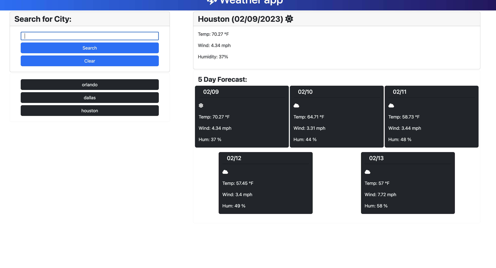

# weather-dashboard-06


A weather dashboard that runs in the browser and pulls 5 days of weather for where the user decides to search data used if from open weather API

## Functionality 
*City Name and Current Date
* Curret temperature, humidity , wind index, and current uv
* 5 day forcast with dates, weather icons, and humidity 

## Visuals

## Features 
*HTML
CSS
BOOTSTRAP
THIRD PARTY API

## LINKS
* [repo] https://github.com/01magdalenawild/weather-dashboard-06
* [deployed website]  


## Assignment Instructions

### User Story

```
AS A traveler
I WANT to see the weather outlook for multiple cities
SO THAT I can plan a trip accordingly
```

### Acceptance Criteria

```
GIVEN a weather dashboard with form inputs
WHEN I search for a city
THEN I am presented with current and future conditions for that city and that city is added to the search history
WHEN I view current weather conditions for that city
THEN I am presented with the city name, the date, an icon representation of weather conditions, the temperature, the humidity, and the wind speed
WHEN I view future weather conditions for that city
THEN I am presented with a 5-day forecast that displays the date, an icon representation of weather conditions, the temperature, the wind speed, and the humidity
WHEN I click on a city in the search history
THEN I am again presented with current and future conditions for that city
```
